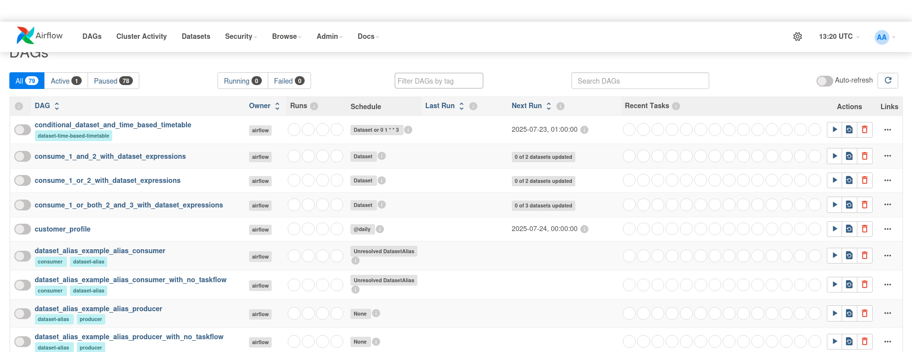
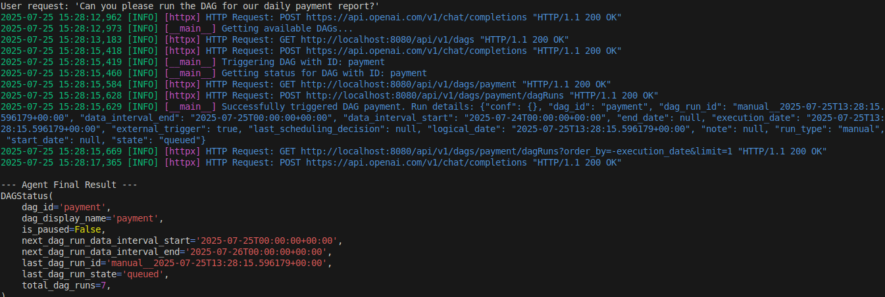
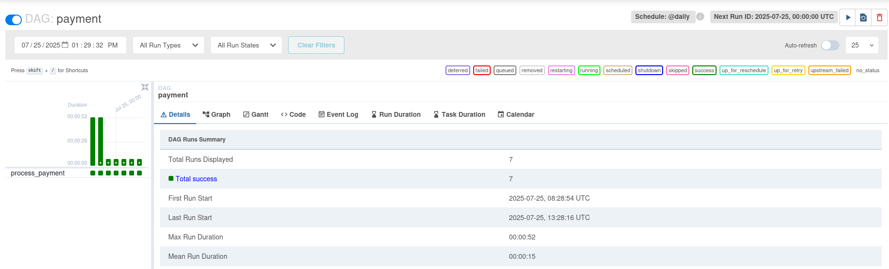

# Airflow AI Agent

## Description
An intuitive agent that allows you to manage and monitor your Apache Airflow DAGs using natural language commands.

* works great with Airflow 2.10.0 (this version is provided in docker-compose.yaml)
## Installation

1. Create folders
```bash
mkdir -p ./dags ./logs ./plugins
```
2. Then start the servers
```bash
echo -e "AIRFLOW_UID=$(id -u)" > .env
AIRFLOW_UID=50000
docker-compose up airflow-init
```
3. After initialization is complete, you should see a message like below.
```bash
airflow-init_1       | Upgrades done
airflow-init_1       | Admin user airflow created
airflow-init_1       | 2.10.0
start_airflow-init_1 exited with code 0
```
4. Now you can run
```bash
docker-compose up 
```
5. Access Airflow UI using http://localhost:8080. 
Login / Password : airflow / airflow


## Example of Usage

Here is our Airflow UI, where we have lots of DAG's. There I have an example *payment* DAG.


In **src/agent.py** there is a *user_request* variable. You can type there any command that will be given to an agent.

My command is *"Can you please run the DAG for our daily payment report?"*

Let's run this!

```bash
python3 src/agent.py
```

Here is a result


We can see that our DAG has worked successfully in Airflow UI 

